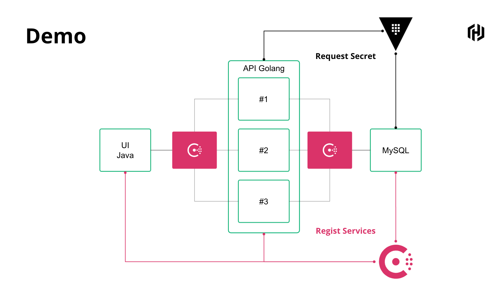

```
vault write mysql-nomad/config/mysql-handson-db \
  plugin_name=mysql-legacy-database-plugin \
  connection_url="{{username}}:{{password}}@tcp(192.168.1.6:3306)/" \
  allowed_roles="role-handson" \
  username="root" \
  password="rooooot"

vault write mysql-nomad/roles/role-handson \
  db_name=mysql-handson-db \
  creation_statements="CREATE USER '{{name}}'@'%' IDENTIFIED BY '{{password}}';GRANT SELECT ON handson.auth_user TO '{{name}}'@'%';" \
  default_ttl="1h" \
  max_ttl="24h"
```